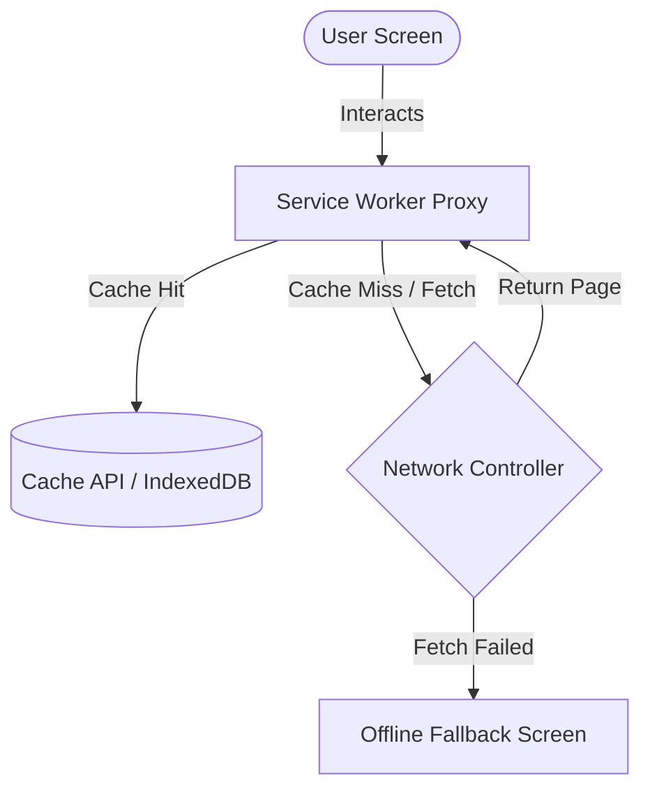

# Progressive Web Application (PWA) Integration Guide - Designs of Dreams (DOD)

Making Designs of Dreams (DOD) a **Progressive Web Application (PWA)** ensures that clients experience a premium, app-like native feel on both iOS and Android. This includes offline catalog browsing, fast page load speeds, screen installation, and background sync.

---

## 1. PWA Architecture Overview

A Next.js PWA consists of three core components:
1.  **Web App Manifest (`public/manifest.json`)**: Configures app branding, icon coordinates, splash screens, and standalone display properties.
2.  **Service Worker (`sw.js`)**: A client-side network proxy that intercepts fetches, serves cached assets, performs background data prefetching, and receives push alerts.
3.  **Caching Strategy**: Rules that govern when assets are served from the Cache API versus when they fetch from the network.



---

## 2. Next.js PWA Plugin Configuration

We use `@ducanh2912/next-pwa` (already present in `package.json`). To configure the bundler, update `next.config.ts` as follows:

```typescript
// next.config.ts
import path from "path";
import type { NextConfig } from "next";
import withPWAInit from "@ducanh2912/next-pwa";

const withPWA = withPWAInit({
  dest: "public",
  disable: process.env.NODE_ENV === "development",
  register: true,
  skipWaiting: true,
  fallbacks: {
    document: "/~offline", // Custom offline page route
  },
  workboxOptions: {
    runtimeCaching: [
      {
        // Cache next.js page assets
        urlPattern: /\.(?:js|css)$/i,
        handler: "StaleWhileRevalidate",
        options: {
          cacheName: "nextjs-static-assets",
          expiration: { maxEntries: 64 },
        },
      },
      {
        // Cache dynamic image uploads & external photos
        urlPattern: /^https:\/\/images\.unsplash\.com\/.*/i,
        handler: "CacheFirst",
        options: {
          cacheName: "external-unsplash-images",
          expiration: {
            maxEntries: 100,
            maxAgeSeconds: 30 * 24 * 60 * 60, // 30 days
          },
        },
      },
      {
        // Cache fonts
        urlPattern: /\.(?:woff2?|eot|ttf|otf)$/i,
        handler: "CacheFirst",
        options: {
          cacheName: "web-fonts",
          expiration: { maxEntries: 10 },
        },
      },
    ],
  },
});

const nextConfig: NextConfig = {
  turbopack: {
    root: path.join(__dirname),
  },
  images: {
    remotePatterns: [
      {
        protocol: "https",
        hostname: "images.unsplash.com",
      },
    ],
  },
  async redirects() {
    return [
      {
        source: "/admin",
        destination: "/",
        permanent: true,
      },
    ];
  },
};

export default withPWA(nextConfig);
```

---

## 3. Web App Manifest Specification

The manifest configuration provides the details necessary for browsers to prompt mobile users to add the website to their home screen.

```json
// public/manifest.json
{
  "name": "Designs of Dreams",
  "short_name": "DOD",
  "description": "Premium heritage fashion and artisanal clothing.",
  "start_url": "/",
  "display": "standalone",
  "background_color": "#1A1A1A",
  "theme_color": "#C5A059",
  "orientation": "portrait-primary",
  "dir": "ltr",
  "lang": "en-US",
  "categories": ["shopping", "fashion"],
  "icons": [
    {
      "src": "/icons/icon-192x192.png",
      "sizes": "192x192",
      "type": "image/png",
      "purpose": "any maskable"
    },
    {
      "src": "/icons/icon-512x512.png",
      "sizes": "512x512",
      "type": "image/png",
      "purpose": "any maskable"
    }
  ],
  "shortcuts": [
    {
      "name": "View Cart",
      "url": "/cart",
      "icons": [{ "src": "/icons/cart-icon.png", "sizes": "96x96" }]
    },
    {
      "name": "My Profile",
      "url": "/profile",
      "icons": [{ "src": "/icons/profile-icon.png", "sizes": "96x96" }]
    }
  ]
}
```

---

## 4. Custom App Install Prompt Component

Browsers default to generic, unstyled banners to prompt app installation. For a premium couture look, implement a custom-designed, brand-aligned banner (Charcoal and Gold) that matches the DOD aesthetic.

Create the installation trigger component:

```tsx
// src/components/common/PwaInstallPrompt.tsx
"use client";

import React, { useEffect, useState } from "react";
import { X, Download, Smartphone } from "lucide-react";
import { AnimatePresence, motion } from "framer-motion";

interface BeforeInstallPromptEvent extends Event {
  readonly platforms: Array<string>;
  readonly userChoice: Promise<{
    outcome: "accepted" | "dismissed";
    platform: string;
  }>;
  prompt(): Promise<void>;
}

export default function PwaInstallPrompt() {
  const [deferredPrompt, setDeferredPrompt] = useState<BeforeInstallPromptEvent | null>(null);
  const [isVisible, setIsVisible] = useState(false);

  useEffect(() => {
    const handleBeforeInstallPrompt = (e: Event) => {
      e.preventDefault();
      // Stash the event so it can be triggered later.
      setDeferredPrompt(e as BeforeInstallPromptEvent);
      // Show install prompt option if not dismissed in current session
      const isDismissed = sessionStorage.getItem("pwa_install_dismissed");
      if (!isDismissed) {
        setIsVisible(true);
      }
    };

    window.addEventListener("beforeinstallprompt", handleBeforeInstallPrompt);

    return () => {
      window.removeEventListener("beforeinstallprompt", handleBeforeInstallPrompt);
    };
  }, []);

  const handleInstallClick = async () => {
    if (!deferredPrompt) return;
    
    // Show the native browser install prompt
    await deferredPrompt.prompt();
    
    // Wait for the user to respond to the prompt
    const { outcome } = await deferredPrompt.userChoice;
    
    if (outcome === "accepted") {
      console.log("User accepted the install prompt");
    } else {
      console.log("User dismissed the install prompt");
    }
    
    // Clear deferred prompt variable
    setDeferredPrompt(null);
    setIsVisible(false);
  };

  const handleDismiss = () => {
    sessionStorage.setItem("pwa_install_dismissed", "true");
    setIsVisible(false);
  };

  if (!isVisible) return null;

  return (
    <AnimatePresence>
      <motion.div
        initial={{ y: 100, opacity: 0 }}
        animate={{ y: 0, opacity: 1 }}
        exit={{ y: 100, opacity: 0 }}
        transition={{ type: "spring", damping: 25, stiffness: 200 }}
        className="fixed bottom-20 left-4 right-4 z-50 md:bottom-6 md:right-6 md:left-auto md:w-96 p-4 rounded-xl bg-zinc-950/95 border border-amber-500/30 shadow-2xl backdrop-blur-md flex flex-col gap-3 text-white font-body"
      >
        <div className="flex justify-between items-start">
          <div className="flex gap-3 items-center">
            <div className="p-2 rounded-lg bg-amber-500/10 text-amber-500">
              <Smartphone size={24} />
            </div>
            <div>
              <h4 className="text-sm font-semibold tracking-wider uppercase text-amber-500">
                Install Designs of Dreams
              </h4>
              <p className="text-xs text-zinc-400 mt-0.5">
                Enjoy offline access, faster load speeds, and notifications.
              </p>
            </div>
          </div>
          <button
            onClick={handleDismiss}
            className="text-zinc-500 hover:text-white transition-colors duration-200"
          >
            <X size={18} />
          </button>
        </div>

        <div className="flex gap-2 justify-end mt-1">
          <button
            onClick={handleDismiss}
            className="px-4 py-2 text-xs font-semibold tracking-widest uppercase text-zinc-400 hover:text-white transition-colors duration-200"
          >
            Later
          </button>
          <button
            onClick={handleInstallClick}
            className="px-5 py-2 text-xs font-semibold tracking-widest uppercase bg-amber-500 text-zinc-950 hover:bg-amber-600 transition-all duration-200 flex items-center gap-1.5 rounded"
          >
            <Download size={14} /> Install App
          </button>
        </div>
      </motion.div>
    </AnimatePresence>
  );
}
```

Add `<PwaInstallPrompt />` in `src/app/layout.tsx` to mount it globally.

---

## 5. Offline Fallback & Sync Handling

When internet connectivity drops, the service worker intercept detects the error and serves the fallback page defined in `fallbacks` (`/~offline`).

### Pre-populating Cached Pages
To provide a smooth experience, precache important informational pages that a disconnected shopper might want to visit:
*   `/` (Home Catalog)
*   `/collection`
*   `/about`
*   `/contact`

### Background Synchronization
When a checkout or address update is submitted offline, use the Service Worker's **Background Sync** to queue payloads in IndexedDB and send them once network connection resumes.

```javascript
// Register Background Sync in Sw.js
self.addEventListener("sync", (event) => {
  if (event.tag === "sync-cart-updates") {
    event.waitUntil(syncCartWithDatabase());
  }
});

async function syncCartWithDatabase() {
  const offlineItems = await getQueuedItemsFromIndexedDb();
  for (const item of offlineItems) {
    await fetch("/api/cart", {
      method: "POST",
      body: JSON.stringify(item),
      headers: { "Content-Type": "application/json" },
    });
  }
}
```

---

## 6. Push Notifications Setup

Keep clientele updated on order shipments or exclusive collection drops.

### Step 1: VAPID Key Generation
Install `web-push` to generate secure credentials:
```bash
npx web-push generate-vapid-keys
```
Save the public and private keys in `.env.local`:
```env
NEXT_PUBLIC_VAPID_PUBLIC_KEY="YOUR_PUBLIC_KEY"
VAPID_PRIVATE_KEY="YOUR_PRIVATE_KEY"
```

### Step 2: Client Subscription Setup
Request notification permissions and generate subscription details:

```typescript
export async function subscribeToPushNotifications() {
  const registration = await navigator.serviceWorker.ready;
  const subscription = await registration.pushManager.subscribe({
    userVisibleOnly: true,
    applicationServerKey: urlBase64ToUint8Array(process.env.NEXT_PUBLIC_VAPID_PUBLIC_KEY!),
  });

  // Save the subscription object on the database linked to User Profile
  await fetch("/api/notifications/subscribe", {
    method: "POST",
    body: JSON.stringify(subscription),
    headers: { "Content-Type": "application/json" },
  });
}
```

### Step 3: Service Worker Event Listener
Add push and notification click listeners inside your custom service worker:

```javascript
// public/custom-sw.js
self.addEventListener("push", (event) => {
  const data = event.data.json();
  const options = {
    body: data.body,
    icon: "/icons/icon-192x192.png",
    badge: "/icons/badge-icon.png",
    data: { url: data.url },
  };

  event.waitUntil(self.registration.showNotification(data.title, options));
});

self.addEventListener("notificationclick", (event) => {
  event.notification.close();
  event.waitUntil(clients.openWindow(event.notification.data.url));
});
```

---

## 7. Testing & Verification

Use Chrome Developer Tools to inspect and debug PWA performance:
1.  **Application Panel**:
    *   **Manifest**: Inspect manifest validation, app shortcuts, and install icons.
    *   **Service Workers**: Verify the service worker is active, running, and listening to events. Click "Offline" checkbox to test connection drop.
    *   **Cache Storage**: Inspect stored bundles, web fonts, and external Unsplash images.
2.  **Lighthouse Audit**: Run audits for **PWA** to ensure all installability, metadata, service worker redirects, and HTTPS requirements are fully passed with a 100% checkmark.
