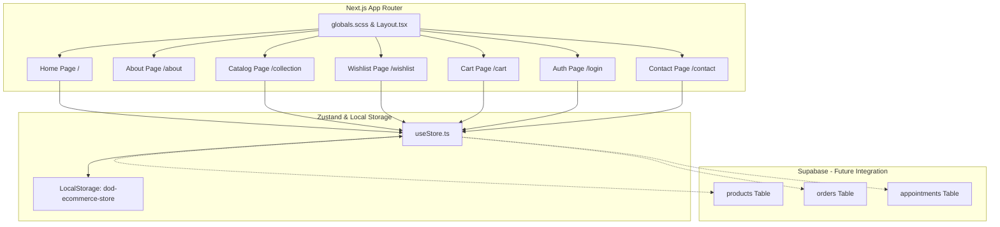

# Designs of Dreams (DOD Shop) — Full Website Documentation & Architectural Overview

Welcome to the comprehensive technical documentation and system architecture guide for **Designs of Dreams (DOD Shop)**. This document serves as a detailed breakdown of the entire luxury heritage ethnic wear e-commerce website, detailing client user flows, interactive UI sections, state management, and developer setup instructions.

---

## 🗺️ System & Folder Architecture

The website is engineered using **Next.js 16 (App Router)** and **TypeScript**, with styling defined via modular **Sass (SCSS)** and helpers from **TailwindCSS v4**. Local states are persistence-cached on client sessions using a custom **Zustand** store.



---

## 🎨 Global Design System & Variables

The brand maintains a highly disciplined, luxury aesthetic that reflects Varanasi's gold and silk heritage using a strict three-color palette.

### 1. Brand Color Palettes
All styles are defined in [variables.scss](file:///c:/Users/harsh/Desktop/DOD/dodshop/src/styles/variables.scss):

| Variable | Value | CSS Custom Property | Role |
| :--- | :--- | :--- | :--- |
| `$brand-orange` | `#FF6A00` | `--primary` | Active elements, premium accents, CTAs, highlight badges |
| `$brand-white` | `#FFFFFF` | `--white` / `--bg-main` | Page backgrounds, high-contrast layouts |
| `$brand-black` | `#000000` | `--black` / `--text-main` | Headers, grid borders, descriptive body text |
| `$primary-soft` | `rgba(255, 106, 0, 0.1)` | — | Smooth hover overlays and badge fills |
| `$black-soft` | `#121212` | — | Secondary container blocks and cards |
| `$white-soft` | `#FAFAFA` | — | Interactive control blocks and dropdown inputs |

### 2. Styling Tokens & Effects
*   **Font System**: Modern typography combining elegant serif styles for titles and high-readability sans-serif text (Poppins/Inter).
*   **Decorative Backdrop**: A delicate geometric SVG Jali pattern applied as a low-opacity ($5\%$) background overlay to pages.
    ```css
    background-image: url("data:image/svg+xml,%3Csvg width='80' height='80' viewBox='0 0 80 80' xmlns='http://www.w3.org/2000/svg'%3E%3Ccircle cx='40' cy='40' r='38' fill='none' stroke='%23000000' stroke-width='0.5'/%3E%3C/svg%3E")
    ```
*   **Luxury Easing Curve**: Smooth transition velocities for mouse-hover scaling and overlay slide-downs.
    ```scss
    $ease-luxury: cubic-bezier(0.25, 0.46, 0.45, 0.94);
    ```

---

## 📄 Core Website Pages & Layout Details

Each page is designed as a standalone component bundle inside `src/app/`, fetching dynamic configurations and managing UI animations.

### 1. Home Page (`/`)
*Entry point:* [page.tsx](file:///c:/Users/harsh/Desktop/DOD/dodshop/src/app/page.tsx)
The landing page contains several immersive section components that capture the brand's aesthetic:
*   **Authentic Preloader**: Renders a luxury introductory preloader containing elegant calligraphy and fading transitions.
*   **Cinematic Hero Banner**: Features a multi-slide Swiper with GSAP-powered floating animations, custom pagination, and mouse-controlled parallax effects. Includes three distinct slides:
    1. *"A place to display your Heritage."*
    2. *"Elegance in Every Thread."*
    3. *"Redefining Luxury Fashion."*
*   **Interactive Heritage Cards Strip**: Positioned at the base of the Hero section, providing clickable overlays detailing:
    *   *Heritage Storytelling* (Ancient looms and traditions)
    *   *Handcrafted Luxury* (Artisanal stitch techniques)
    *   *Museum Editorial Feel* (Curated collections)
    *   *Premium Ethnic Identity* (Rooted yet global silhouettes)
    *   *Emotional Connection* (Generational family inheritances)
*   **Signature Collections Grid**: Renders the 4 core product categories with slide-over panels, hover-dimming effects, and navigation shortcuts.
*   **Artisan Process Gallery**: High-resolution gallery showing weaving stages (silk-spinning, block-printing, loom setup) with full modal preview transitions.
*   **Client Concierge FAQ Accordion**: A structured accordion filtered by categories (*Our Products, Shipping, Care & Returns*) showcasing details on fabrics, weaving timelines, and product care guidelines.

### 2. About Us Page (`/about`)
*Entry point:* [About.tsx](file:///c:/Users/harsh/Desktop/DOD/dodshop/src/components/sections/About/About.tsx)
Documents the history, craftsmanship values, and artisan contributions:
*   **Split Story Block (The Legend of Peeli Kothi)**: Outlines the brand's origin in the silk-weaving district of Varanasi and the mission to preserve slow fashion against powerlooms.
*   **Craftsmanship Pillars**:
    *   *Heritage Preservation*: Working with generational Varanasi weavers.
    *   *Artisanal Integrity*: Hand-shadow Chikankari and Zardozi knot details.
    *   *Authentic Materials*: 100% pure mulberry silks, organic cottons, and metallic zari.
*   **Sacred Journey Timeline**:
    *   `1994` - *The First Handloom*: Two looms established in the lanes of Varanasi.
    *   `2008` - *Artisan Collective*: Expanding to support 50+ weaver families.
    *   `2018` - *Designs of Dreams Atelier*: Launching the flagship direct-from-weaver showroom.
    *   `2026` - *Global Legacy*: Showcasing Banaras craftsmanship internationally.
*   **Tribute to Weavers (The Hands of Banaras)**: Section demonstrating commitment to weaver communities, highlighting support for **120+ master weavers & craftspeople**.

### 3. Collection Catalog (`/collection`)
*Entry point:* [CollectionCatalog.tsx](file:///c:/Users/harsh/Desktop/DOD/dodshop/src/app/collection/CollectionCatalog.tsx)
A dynamic, state-driven grid rendering the e-commerce inventory:
*   **Interactive Tabs**: Categorize products by category: *All Masterpieces, Sarees, Kurtis, Blouses, Dupattas*.
*   **Filtering & Sorting**: Users can search by title/description and sort products by *Price: Low to High*, *Price: High to Low*, or *Top Rated*.
*   **Quick View Detail Modal**: Triggered on product card click. Features:
    *   High-resolution zoom product image with custom badges.
    *   Size selectors (e.g. *S, M, L, XL* for Kurtis; *One Size* for Sarees/Dupattas; *34-42* for Blouses).
    *   Atelier detail metrics (Fabrics, Heritage features, and long descriptions).
    *   Integrated quantity selectors with direct add-to-bag triggers.

### 3.5 Premium Saree Details Page (`/product/[id]`)
*Entry point:* [page.tsx](file:///c:/Users/harsh/Desktop/DOD/dodshop/src/app/product/[id]/page.tsx)
A premium Soft Sage themed, high-conversion product layout featuring:
*   **Gallery Section**: Zoom-on-hover main viewport, vertical thumbnail sliders, interactive 360° rotation preview dragging screen, and video modal overlay.
*   **Information Block**: Star ratings, bestseller and exclusive inventory stock limits, original vs. discounted prices.
*   **Variant Swatches**: Dynamic color swatch selectors (Soft Sage Green, Crimson Rose, Brocade Gold), fabric material, and custom-tailored drape blouse options.
*   **Purchase CTAs**: Add to Bag, Buy Now checkout redirects, and wishlist/share actions.
*   **Checkers & Trust**: Delivery pincode checkers displaying shipping estimates, COD status, alongside Silk Mark certification badges.
*   **Craftsmanship Parallax**: Parallax background displaying loom weaving and story-telling text.
*   **Review Summary**: Breakdown metrics, photo carousels, and verified buyer reviews with helpful votes.
*   **FBT Bundler**: Frequently Bought Together bundle selector with checkboxes, subtotal calculations, and a single click bundle cart addition.

### 4. Styling Atelier & Appointments (`/contact`)
*Entry point:* [Contact.tsx](file:///c:/Users/harsh/Desktop/DOD/dodshop/src/components/sections/Contact/Contact.tsx)
The booking system allows customers to request physical, private consultations at the flagship workshop:
*   **Flagship Showroom details**: Location at *Peeli Kothi Crossing, Varanasi*, contact phone *+91 98765 43210*, and operating hours.
*   **Booking Fields**:
    *   `Guest Name` (Full name input)
    *   `Email Address` & `Phone Number`
    *   `Atelier Interest` (Dropdown menu selecting: *Saree Collection, Chikankari Kurti, Custom Lehenga, Artisanal Blouse*)
    *   `Booking Date` (HTML5 Calendar picker)
    *   `Bespoke Customizations` (Measurements/notes textarea)
*   **Feedback System**: An animated success notification fades in upon form submission and resets fields automatically:
    > *"Request Submitted — We have received your appointment request. Check your inbox shortly for our confirmation call."*

### 5. Cart & Checkout System (`/cart`)
*Entry point:* [page.tsx](file:///c:/Users/harsh/Desktop/DOD/dodshop/src/app/cart/page.tsx)
Tracks, aggregates, and calculates totals for selected products:
*   **Dynamic Item Management**: Custom side-drawers or tables tracking order quantities, sizes, and item deletions.
*   **E-Commerce Calculations**:
    $$\text{Subtotal} = \sum (\text{Price} \times \text{Quantity})$$
    $$\text{GST} = \text{Subtotal} \times 5\%$$
    $$\text{Shipping} = \begin{cases} 0, & \text{if Subtotal} \ge \text{₹1,999} \\ \text{₹150}, & \text{otherwise} \end{cases}$$
    $$\text{Grand Total} = \text{Subtotal} + \text{GST} + \text{Shipping}$$
*   **Checkout Gateway Inputs**: Cash on Delivery (COD), UPI transfer protocols, and Credit/Debit card options.

### 6. Wishlist Vault (`/wishlist`)
*Entry point:* [page.tsx](file:///c:/Users/harsh/Desktop/DOD/dodshop/src/app/wishlist/page.tsx)
Allows users to save and track target masterpieces:
*   State-synchronized hearts across the home, catalog, and product modals.
*   "Quick Add to Bag" action, defaulting to standard or singular sizes.
*   Smooth Framer Motion grid exit transitions on removal.

### 7. Sign In & Authentication (`/login`)
*Entry point:* `/src/app/login/`
Split layout containing credential forms:
*   Interactive slide-out credentials panel with client-side form validations.
*   Zustand-integrated `login` and `signup` hooks caching profile names and active email sessions.

---

## 📊 E-Commerce Data Models

Below are the product records and schemas defining the e-commerce collections, stored inside the Zustand state manager:

| ID | Title | Category | Subcategory | Price (INR) | Fabrics | Core Features |
| :--- | :--- | :--- | :--- | :--- | :--- | :--- |
| **1** | Royal Katan Silk Banarasi Saree | Saree | Banarasi | ₹12,999 | Katan Silk, Pure Zari | Pure Kadwa weave, paisley pallu |
| **2** | Gilded Crimson Organza Saree | Saree | Silk | ₹8,499 | Organza Silk, Zari Blend | Scalloped embroidery, pastel hues |
| **3** | Heritage Chanderi Zardozi Saree | Saree | Chanderi | ₹9,999 | Chanderi Silk, Zari Cotton | Hand zardozi work, eco-friendly dye |
| **4** | Anarkali Chikankari Kurti | Kurti | Anarkali Kurti | ₹3,499 | Georgette, Chikankari | Shadow embroidery, flared, with slip |
| **5** | Premium Cotton Straight Kurti | Kurti | Straight Kurti | ₹1,899 | 100% Pure Cotton | Hand-block printed, indigo dye |
| **6** | Mulmul Silk Partywear Kurti | Kurti | Party Wear | ₹4,299 | Mulmul Silk, Mulberry | Real mirror work, comfort lining |
| **7** | Raw Silk Zardozi Blouse | Blouse | Custom | ₹2,499 | Raw Silk, Zardozi | Sweetheart neck, padded cups |
| **8** | Velvet Royal Heritage Blouse | Blouse | Designer | ₹3,199 | Micro Velvet, Gold Zari | Elbow sleeves, deep back neck |
| **9** | Brocade Floral Padded Blouse | Blouse | Ready Made | ₹1,999 | Brocade, Polyester | Keyhole back, side zipper |
| **10** | Pure Silk Banarasi Dupatta | Dupatta | Heavy | ₹3,999 | Katan Silk, Pure Zari | Paisley designs, gold tassel border |
| **11** | Chiffon Gota Patti Dupatta | Dupatta | Light | ₹1,499 | Pure Chiffon, Gota | Gota Patti border, handmade mirrors |
| **12** | Hand-Dyed Bandhani Dupatta | Dupatta | Floral | ₹1,799 | Cotton Silk Blend | Bandhani nodes, gold zari accents |

---

## 🛠️ Developer Setup & Commands

Follow these scripts inside your terminal shell to run, lint, and build the environment:

> [!IMPORTANT]
> Ensure you have **Node.js (v18.0.0 or higher)** installed on your operating system.

### 1. Install Dependencies
```powershell
npm install
```

### 2. Launch Local Dev Server
```powershell
npm run dev
```
Serves the local build at [http://localhost:3000](http://localhost:3000).

### 3. Verify Code Quality & Format
```powershell
# Run ESLint validation
npm run lint

# Compile and check TypeScript types
npx tsc --noEmit
```

### 4. Build & Export Production Bundle
```powershell
# Compile optimized static bundle
npm run build

# Start the compiled server locally
npm run start
```

---


For transitioning the catalog from local memory to a secure remote cloud database, apply the following SQL configuration in your Supabase SQL Editor:

```sql
-- 1. Create Products Table
CREATE TABLE products (
  id BIGSERIAL PRIMARY KEY,
  created_at TIMESTAMPTZ DEFAULT NOW(),
  title TEXT NOT NULL,
  subtitle TEXT,
  category TEXT NOT NULL,
  subcategory TEXT,
  desc_text TEXT,
  long_desc TEXT,
  price NUMERIC NOT NULL,
  image TEXT,
  badge TEXT,
  fabrics TEXT[] DEFAULT '{}',
  features TEXT[] DEFAULT '{}',
  sizes TEXT[] DEFAULT '{}',
  rating NUMERIC DEFAULT 5.0
);

-- 2. Create Orders Table
CREATE TABLE orders (
  id TEXT PRIMARY KEY,
  created_at TIMESTAMPTZ DEFAULT NOW(),
  customer_name TEXT,
  customer_email TEXT,
  address TEXT,
  city TEXT,
  pincode TEXT,
  payment_method TEXT DEFAULT 'COD',
  subtotal NUMERIC,
  tax NUMERIC,
  shipping NUMERIC,
  grand_total NUMERIC,
  status TEXT DEFAULT 'Pending',
  items JSONB DEFAULT '[]'
);

-- 3. Create Styling Appointments Table
CREATE TABLE appointments (
  id BIGSERIAL PRIMARY KEY,
  created_at TIMESTAMPTZ DEFAULT NOW(),
  name TEXT NOT NULL,
  email TEXT NOT NULL,
  phone TEXT NOT NULL,
  interest TEXT DEFAULT 'Saree',
  booking_date DATE,
  message TEXT,
  status TEXT DEFAULT 'Pending'
);
```
